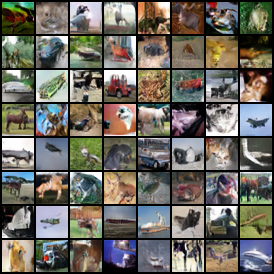

# spectral-normalization-gan

This is the final project of [Deep Learning on Computational Accelerators](https://vistalab-technion.github.io/cs236605/).
> As part of this course, students must complete a small research project instead of a final exam.
> For this project you will either implement a current deep-learning research paper or implement a custom project that relates to your current research topic (subject to approval).
> The idea is to select a paper that seems interesting you, implement it, suggest at least one improvement and evaluate it as well. - TA

## Install
1. Clone this repository and make sure you installed the python3 version of [miniconda](https://docs.conda.io/en/latest/miniconda.html).
```
git clone --recurse-submodules https://github.com/ctjoy/deep-learning-project
cd deep-learning-project
```
2. Use conda to create a virtual environment named `sngan`. From the root directory, run
```
conda env create -f environment.yml
```
3. Activate the new environment by running
```
conda activate sngan
```
Note: If there is any update in the `environment.yml` file. You can use
```
conda env update
```
## Training
```
python main.py [--model] [--loss]
```
- model: dcgan, resnet
- loss: bce, hinge, wasserstein

## Evaluation
Using the [Inception Score](https://github.com/sbarratt/inception-score-pytorch) and [FID Score](https://github.com/mseitzer/pytorch-fid) according to the paper.
```
python evaluate.py
```

## What problem does SNGAN solve?
When using the SNGAN, they can generate examples that are much more diverse than the conventional weight normalization and achieve better or comparative inception scores.

## Implementation Details
- [x] redo the ResNet-like model (with spectral normalization)
- [x] redo the DCGAN-like model (with spectral normalization)
- [x] using the Xavier initialization in ResNet
- [x] add GAN hack on the model
- [x] [Self-Attention for GANs](https://arxiv.org/abs/1805.08318) proposed using spectral normalization for stabilizing training of the generator network as well, so we also add spectral normalization on the generator.

## Result


## References
- Miyato, Takeru, et al. "Spectral normalization for generative adversarial networks." arXiv preprint arXiv:1802.05957 (2018). [OpenReview](https://openreview.net/forum?id=B1QRgziT-)
- Salimans, Tim, et al. "Improved techniques for training gans." Advances in neural information processing systems. 2016. [arxiv](https://arxiv.org/abs/1606.03498)
- [How to Train a GAN? Tips and tricks to make GANs work](https://github.com/soumith/ganhacks)
- [GENERATIVE ADVERSARIAL NETWORKS – PAPER READING ROAD MAP](http://www.codingwoman.com/generative-adversarial-networks-paper-reading-road-map/)
- [Generative Adversarial Networks (GANs) in 50 lines of code (PyTorch)](https://medium.com/@devnag/generative-adversarial-networks-gans-in-50-lines-of-code-pytorch-e81b79659e3f)
- [Advanced GANs - Exploring Normalization Techniques for GAN training: Self-Attention and Spectral Norm](https://sthalles.github.io/advanced_gans/)

## Acknowledgment
Based on the following implementation
* Pytorch official [DCGAN tutorial](https://github.com/pytorch/examples/tree/master/dcgan)
* The Official Chainer implementation from the author ([sngan_projection](https://github.com/pfnet-research/sngan_projection/))
* [godisboy/SN-GAN](https://github.com/godisboy/SN-GAN)
* [christiancosgrove/pytorch-spectral-normalization-gan](https://github.com/christiancosgrove/pytorch-spectral-normalization-gan)
